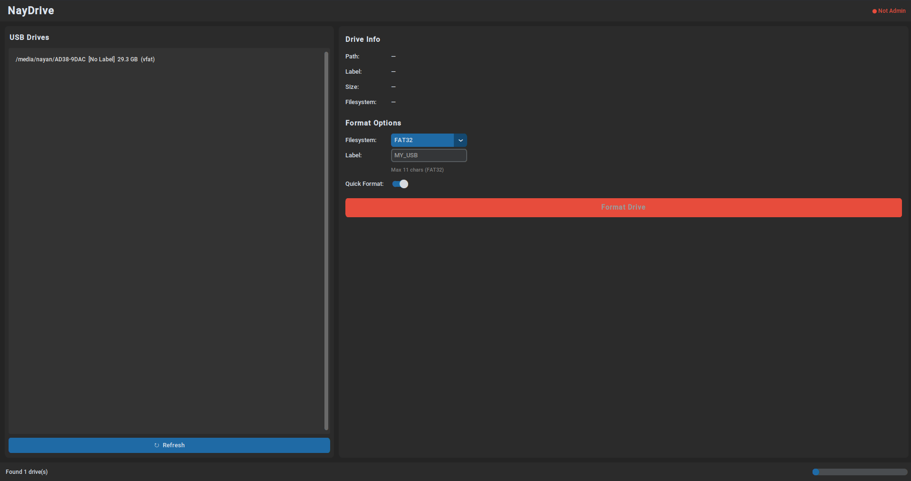

# NayDrive

A simple, modern USB formatting tool for **Windows** and **Linux**, built with Python and CustomTkinter.


---

## Features

- **Auto-detect** all connected removable USB drives
- **Format** to FAT32, exFAT, NTFS, or ext4 (Linux)
- **Quick Format** or full wipe toggle
- **Custom volume label** with per-filesystem character limits
- **Safety first** — system drives are never shown; confirmation dialog before formatting
- **Cross-platform** — works on Windows (diskpart / format) and Linux (mkfs.\*)
- **Dark-themed** modern UI powered by CustomTkinter

---

## Screenshot



---

## Requirements

- Python 3.10 or newer
- `customtkinter >= 5.2.0`
- `psutil >= 5.9.0`

Install dependencies:

```bash
pip install -r requirements.txt
```

---

## Running

```bash
# Linux (needs root for formatting)
sudo python -m naydrive

# Windows (will auto-request admin/UAC)
python -m naydrive
```

---

## Project Structure

```
naydrive/
├── __init__.py      # Package marker
├── __main__.py      # python -m naydrive entry
├── main.py          # Privilege check & app launch
├── ui.py            # CustomTkinter GUI
├── drives.py        # USB drive detection (psutil + sysfs / kernel32)
├── formatter.py     # Format commands (diskpart / mkfs)
├── utils.py         # Helpers (OS detection, size formatting, etc.)
└── assets/
    └── icon.ico     # App icon (optional)
```

---

## Packaging with PyInstaller

```bash
# Windows
pyinstaller --onefile --windowed --icon=naydrive/assets/icon.ico naydrive/main.py --name NayDrive

# Linux
pyinstaller --onefile --windowed naydrive/main.py --name NayDrive
```

The binary will be in `dist/`.

---

## License

MIT
